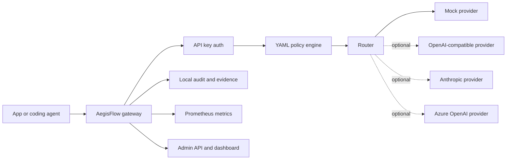
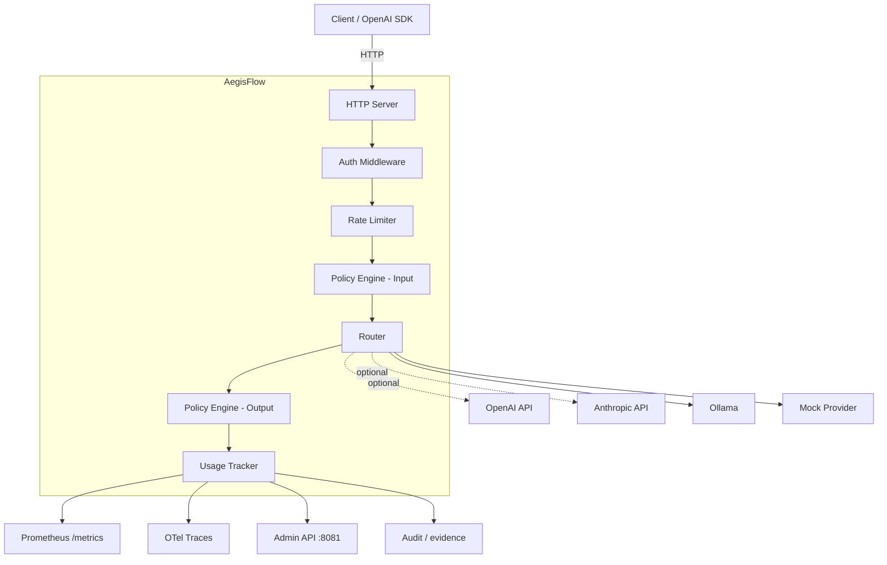
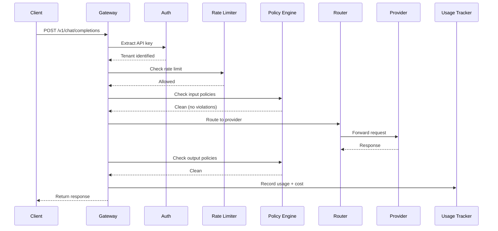

# AegisFlow Architecture

## System Overview

AegisFlow is a single Go binary that acts as a reverse proxy, policy boundary, and control plane for AI/LLM traffic and tool-using agents. It intercepts requests between clients and providers, adding authentication, rate limiting, policy enforcement, routing, usage tracking, approvals, evidence, and observability.

The default path is fully local and cost-free: a mock provider, YAML policies, in-memory storage, local audit evidence, and Prometheus metrics. Real providers, Redis, PostgreSQL, Kubernetes, and external policy systems are optional integrations.

## Local-First Runtime

Nothing in the local path requires a hosted account. Optional providers only run when a user configures their own key.

## Component Diagram

## Request Flow

## Package Structure

| Package | Responsibility |
|---------|---------------|
| `cmd/aegisflow` | Entry point, dependency wiring |
| `internal/config` | YAML configuration loading |
| `internal/gateway` | HTTP handlers for `/v1/chat/completions` and `/v1/models` |
| `internal/middleware` | Auth, rate limiting, logging, metrics middleware |
| `internal/provider` | Provider interface and adapters (Mock, OpenAI, Anthropic, Ollama) |
| `internal/router` | Model-to-provider routing with strategies and fallback |
| `internal/ratelimit` | Rate limiting (in-memory and Redis) |
| `internal/policy` | Input/output policy engine with keyword, regex, and PII filters |
| `internal/usage` | Token counting, cost estimation, per-tenant usage aggregation |
| `internal/telemetry` | OpenTelemetry initialization |
| `internal/admin` | Admin API server (health, metrics, usage) |
| `pkg/types` | Shared request/response types |

## Key Design Decisions

**Single binary, not microservices.** For the MVP, all functionality runs in one process. The internal package boundaries are clean enough to split later if needed.

**OpenAI-compatible API.** Any application using the OpenAI SDK can connect to AegisFlow by changing `base_url`. This is the most important adoption decision.

**Provider interface.** All providers implement the same 6-method interface. Adding a new provider requires zero changes to the gateway, router, or middleware.

**Mock provider first.** The mock provider is a real first-class route target. It keeps demos, tests, CI, and local development free and repeatable.

**Optional external services.** Paid providers, cloud secret managers, hosted tracing backends, Redis, and PostgreSQL are optional. The project must remain useful without them.

**Middleware chain.** Each cross-cutting concern (auth, rate limiting, logging, metrics) is an independent middleware that can be added or removed from the chain.

**In-memory by default, Redis optional.** Rate limiting works without any external dependencies. Redis is available for distributed deployments.

**Circuit breaker per provider.** Failed providers are temporarily removed from the routing pool to prevent cascading failures.
